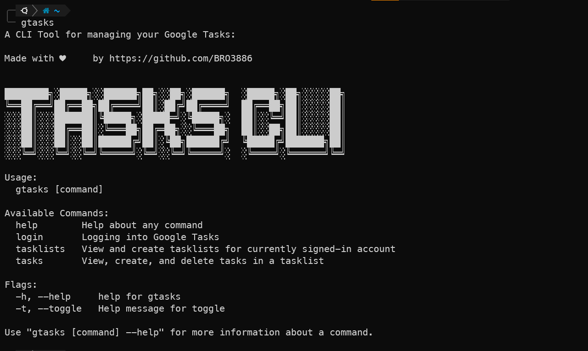

# Google Tasks CLI

`gtasks`: A CLI Tool for Google Tasks



## Currently available commands

- [x] Login
- [x] View Task-List
- [x] Create Task-List
- [ ] Update Task-List
- [x] Delete Task-List
- [x] View Tasks
- [x] Create Tasks
- [ ] Edit Task
- [x] Mark as completed
- [x] Delete Task


## Instructions to install

1. Download the binary for your system (check [releases](https://github.com/BRO3886/google-tasks-cli/releases))
2. Move to a particular folder, for eg Documents
3. Append the absolute path (use ```pwd```) of the folder to ```PATH```
4. Execute ```gtasks``` from anywhere

## Instructions to Run and Build from Source:
  - Pre-requisites
    - Go
  - Directions to install
  ```bash
  git clone https://github.com/BRO3886/google-tasks-cli
  ```
  - Directions to execute
  
  (if you're on linux)
  
  ```bash
  make linux 
  ./bin/linux/gtasks <COMMAND>
  ```

  (if you're on windows)
  
  ```bash
  make windows
  ./bin/windows/gtasks <COMMAND>
  ```

  Or, you can check out the pre-compiled binaries under **Releases**

  - Usage
```
Usage:
  gtasks [command]

Available Commands:
  help        Help about any command
  login       Logging into Google Tasks
  tasklists   View and create tasklists for currently signed-in account
  tasks       View, create, list and delete tasks in a tasklist

Flags:
  -h, --help     help for gtasks
  -t, --toggle   Help message for toggle

Use "gtasks [command] --help" for more information about a command.
```

## Commands

* To see details about a command
```bash
gtasks <COMMAND> help
```

* Login
```bash
gtasks login
```
* Viewing Tasklists
```bash
gtasks tasklists view
```
* Creating a Tasklist
```bash
gtasks tasklists create -t 'title'
gtasks tasklists create --title 'title'
```
* Deleting a Tasklist
```bash
gtasks tasklists rm
```
* Viewing tasks
```bash
gtasks tasks view
```
* Viewing completed tasks
```bash
gtasks tasks view -c true
gtasks tasks view --completed true
```
* Adding a task
```bash
gtasks tasks add
```
* Mark task as completed
```bash
gtasks tasks done
```
* Deleting a task
```bash
gtasks tasks rm
```

<div align="center">
Made with :coffee: & <a href="https://cobra.dev">Cobra</a>
</div>
