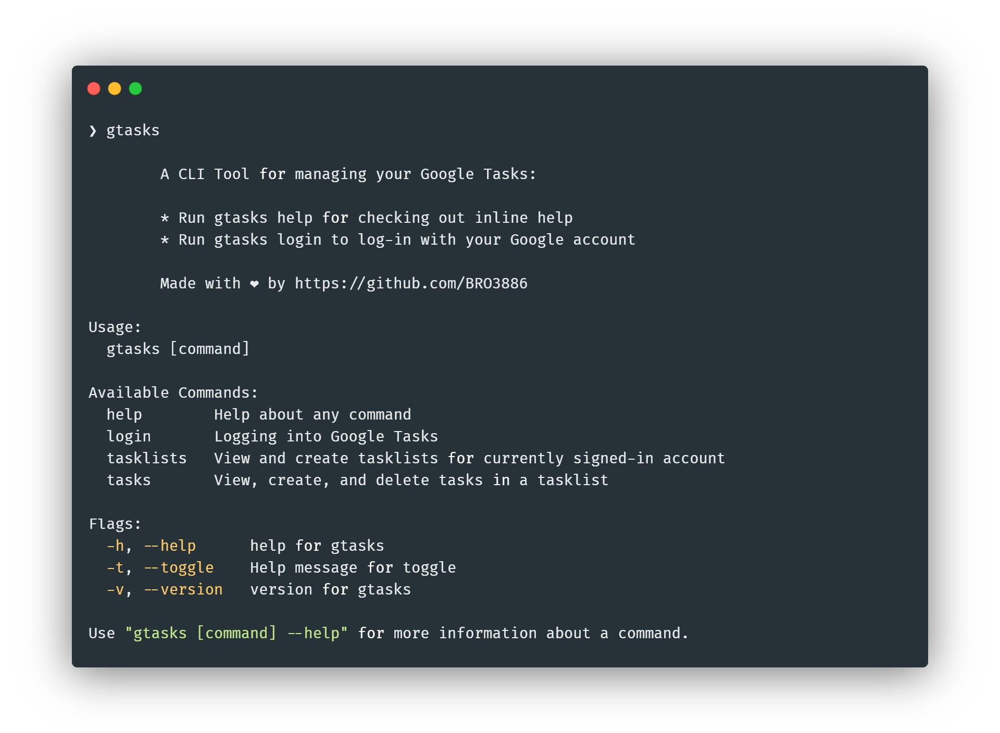

# Google Tasks CLI

`gtasks`: A CLI Tool for Google Tasks



---

## Docs

Refer to the [docs website](https://gtasks.sidv.dev) to read about available commands.

## Instructions to install

(make sure `$HOME/go/bin` is added to `$PATH`

```bash
go install github.com/BRO3886/gtasks@latest
```

or you can download the binary:

1. Download the binary for your system (check [releases](https://github.com/BRO3886/google-tasks-cli/releases))
2. Move to a particular folder, for eg Documents
3. Append the absolute path (use `pwd`) of the folder to `PATH`
4. Execute `gtasks` from anywhere

## Instructions to Run and Build from Source:

- Pre-requisites
  - Go
- Directions to install

```bash
git clone https://github.com/BRO3886/google-tasks-cli
```

- Directions to execute

(if you're on linux)

```bash
make linux
./bin/linux/gtasks <COMMAND>
```

(if you're on windows)

```bash
make windows
./bin/windows/gtasks <COMMAND>
```

Or, you can check out the pre-compiled binaries under **Releases**

- Usage

```
Usage:
  gtasks [command]

Available Commands:
  help        Help about any command
  login       Logging into Google Tasks
  tasklists   View and create tasklists for currently signed-in account
  tasks       View, create, list and delete tasks in a tasklist

Flags:
  -h, --help     help for gtasks
  -t, --toggle   Help message for toggle

Use "gtasks [command] --help" for more information about a command.
```

## Commands

### Help

- To see details about a command

```bash
gtasks <COMMAND> help
```

### Auth

- Login

```bash
gtasks login
```

- Logout

```bash
gtasks logout
```

### Tasklists

- Viewing Tasklists

```bash
gtasks tasklists view
```

- Creating a Tasklist

```bash
gtasks tasklists add -t 'title'
gtasks tasklists add --title 'title'
```

- Deleting a Tasklist

```bash
gtasks tasklists rm
```

### Tasks

- To pre-select tasklist, provide it's title as follows:

```bash
gtasks tasks -l <title> subcommand [--subcommand-flags]
```

Examples:

```bash
gtasks tasks [--tasklist|-l] "DSC VIT" view [--include-completed | -i]
```

**Note:** If the `-l` flag is not provided you will be able to choose a tasklist from the prompt

- Viewing tasks

```bash
gtasks tasks view
```

- Include completed tasks

```bash
gtasks tasks view -i
gtasks tasks view --include-completed
```

- Sort options

```bash
gtasks tasks view ... --sort [due,title,position, default=position]
```

- Adding a task

```bash
gtasks tasks add
```

- Mark task as completed

```bash
gtasks tasks done
```

- Deleting a task

```bash
gtasks tasks rm
```

<div align="center">
Made with :coffee: & <a href="https://cobra.dev">Cobra</a>
</div>
