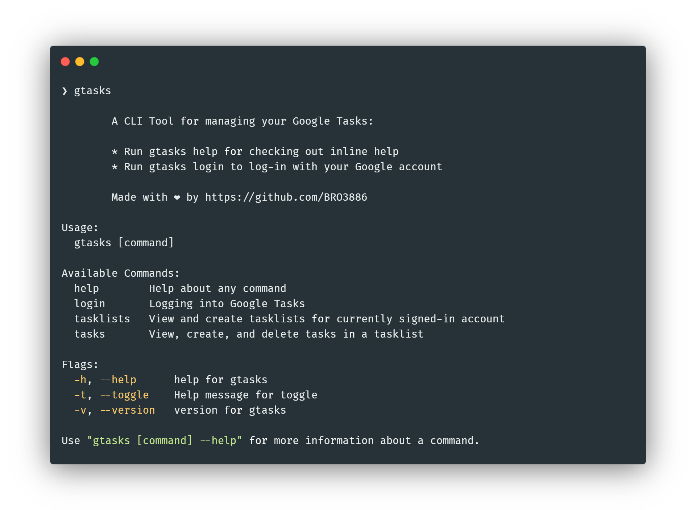

# Google Tasks CLI

`gtasks`: A CLI Tool for Google Tasks



---

## Docs

Refer to the [docs website](https://gtasks.sidv.dev) to read about available commands.

## AI Agent Skills

GTasks includes an embedded [Agent Skill](https://agentskills.io) that can be installed for supported AI agents.

**Supported targets:**
- Claude Code via `~/.claude/skills/gtasks-cli/`
- Codex-compatible agents via `~/.agents/skills/gtasks-cli/`
- OpenClaw via `~/.openclaw/skills/gtasks-cli/`

**Commands:**

```bash
gtasks skills status
gtasks skills install
gtasks skills install --agent codex
gtasks skills uninstall --agent codex
```

**For contributors:** the canonical skill files live in [`internal/skills/assets/gtasks-cli/`](internal/skills/assets/gtasks-cli/).

## Installation

### Homebrew

```bash
brew tap BRO3886/tap
brew install gtasks
```

**macOS / Linux (install script):**

```bash
curl -fsSL https://gtasks.sidv.dev/install | bash
```

Installs to `~/.local/bin` by default. Override with `INSTALL_DIR`:

```bash
INSTALL_DIR=/usr/local/bin curl -fsSL https://gtasks.sidv.dev/install | bash
```

**Manual install:** Download the binary for your system from [releases](https://github.com/BRO3886/gtasks/releases), move it to a directory in your `PATH`, and `chmod +x gtasks`.

**Go install:**

```bash
go install github.com/BRO3886/gtasks@latest
```


## Instructions to Run and Build from Source:

### Prerequisites

- Go 1.24+
- Google Cloud Console OAuth2 credentials (see Configuration section)

### Setup

1. Clone the repository:

```bash
git clone https://github.com/BRO3886/gtasks
cd gtasks
```

2. Set up credentials (see Configuration section below).

### Build Commands

```bash
# Development build
make dev

# Development build with embedded credentials from .env
make dev EMBED_CREDS=1

# Build for specific platforms
make linux    # Linux (amd64 + arm64)
make windows  # Windows (amd64)
make mac      # macOS (amd64 + arm64)

# Build for all platforms
make all

# Create release packages
make release
```

### Configuration

To use GTasks, you need to set up Google OAuth2 credentials:

1. Go to [Google Cloud Console](https://console.cloud.google.com/)
2. Create a new project or select existing one
3. Enable the Google Tasks API
4. Create OAuth2 credentials:

   - Application type: "Web application"
   - Add authorized redirect URIs:
     - `http://localhost:8080/callback`
     - `http://localhost:8081/callback`
     - `http://localhost:8082/callback`
     - `http://localhost:9090/callback`
     - `http://localhost:9091/callback`

5. Supply credentials via environment variables:

```bash
export GTASKS_CLIENT_ID="your-client-id.apps.googleusercontent.com"
export GTASKS_CLIENT_SECRET="your-client-secret"
```

Or add them to `~/.config/gtasks/config.toml` (persistent, no shell profile changes needed):

```toml
[credentials]
client_id     = "your-client-id.apps.googleusercontent.com"
client_secret = "your-client-secret"
```

When building from source, you can also pass credentials at build time:

```bash
make dev EMBED_CREDS=1   # reads GTASKS_CLIENT_ID/SECRET from .env
```

### Token Storage and Configuration

GTasks stores authentication tokens and the optional config file in the same directory.
Discovery order (first existing directory wins):

1. `$XDG_CONFIG_HOME/gtasks/` — XDG standard path; `XDG_CONFIG_HOME` defaults to `~/.config`
2. `~/.gtasks/` — legacy path, used automatically when that directory already exists

New installations use `~/.config/gtasks/` by default.

**Files stored:**

| File | Purpose |
|------|---------|
| `token.json` | OAuth2 token (created on `gtasks login`) |
| `config.toml` | Optional configuration file (created manually) |

See the [Configuration docs](https://gtasks.sidv.dev/docs/configuration/) for the full config file reference.

- Usage

```
Usage:
  gtasks [command]

Available Commands:
  help        Help about any command
  login       Logging into Google Tasks
  tasklists   View and create tasklists for currently signed-in account
  tasks       View, create, list and delete tasks in a tasklist

Flags:
  -h, --help     help for gtasks
  -t, --toggle   Help message for toggle

Use "gtasks [command] --help" for more information about a command.
```

## Commands

### Help

- To see details about a command

```bash
gtasks <COMMAND> help
```

### Auth

- Login

```bash
gtasks login
```

- Logout

```bash
gtasks logout
```

### Tasklists

- Viewing Tasklists

```bash
gtasks tasklists view
```

- Creating a Tasklist

```bash
gtasks tasklists add -t 'title'
gtasks tasklists add --title 'title'
```

- Deleting a Tasklist

```bash
gtasks tasklists rm
```

### Tasks

- To pre-select tasklist, provide it's title as follows:

```bash
gtasks tasks -l <title> subcommand [--subcommand-flags]
```

Examples:

```bash
gtasks tasks [--tasklist|-l] "DSC VIT" view [--include-completed | -i]
```

**Note:** If the `-l` flag is not provided you will be able to choose a tasklist from the prompt

- Viewing tasks

```bash
gtasks tasks view
```

- Include completed tasks

```bash
gtasks tasks view -i
gtasks tasks view --include-completed
```

- Sort options

```bash
gtasks tasks view ... --sort [due,title,position, default=position]
```

- Limit results

```bash
gtasks tasks view --max 10  # Show only first 10 tasks
```

- Adding a task

```bash
gtasks tasks add
```

- Adding a recurring task

```bash
# Create 5 daily tasks starting from Feb 10
gtasks tasks add -t "Standup" -d "2025-02-10" --repeat daily --repeat-count 5

# Create weekly tasks until March 10
gtasks tasks add -t "Weekly sync" -d "2025-02-10" --repeat weekly --repeat-until "2025-03-10"
```

Repeat patterns: `daily`, `weekly`, `monthly`, `yearly`

- Mark task as completed

```bash
gtasks tasks done
```

- Undo a completed task (mark as incomplete)

```bash
gtasks tasks undo
```

- Clear completed tasks (hide from API)

```bash
gtasks tasks clear
gtasks tasks clear --force  # Skip confirmation
```

- View detailed task information (including links/URLs)

```bash
gtasks tasks info [task-number]
```

- Update an existing task

```bash
# Interactive mode - shows current values and prompts for changes
gtasks tasks update [task-number]

# Flag mode - update specific fields
gtasks tasks update 1 --title "New title"
gtasks tasks update 1 --note "Updated note" --due "tomorrow"
```

- Deleting a task

```bash
gtasks tasks rm
```

<div align="center">
Made with :coffee: & <a href="https://cobra.dev">Cobra</a>
</div>
